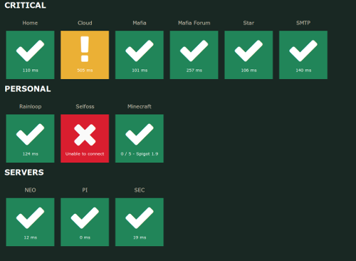

Board [](https://travis-ci.org/Lesterpig/board)
=======================================================================================================================

> One dashboard to check them all.

This repository contains a small web server used to provide a very accurate status *for all your systems*. It also supports live alerts when a service goes down.

With just a glance, you'll be able to spot the faulty parts of your infrastructure.



Installation
------------

```
go get github.com/Lesterpig/board
cp example.yaml board.yaml
vim board.yaml
```

Docker Build
------------
After installation the board can be build as a docker image.

```bash
# Building image
docker build -t lesterpig/board .
# Running container with board.yaml from current dir
docker run -p 8080:8080 -v ${PWD}/board.yaml:/app/board.yaml lesterpig/board
```

Build single binary
-------------------

You may want to include the `/static/` directory as a ZIP resource in your binary.

```
go build -ldflags "-s -w" .
rice append --exec board
```

Documentation: https://github.com/GeertJohan/go.rice#append
